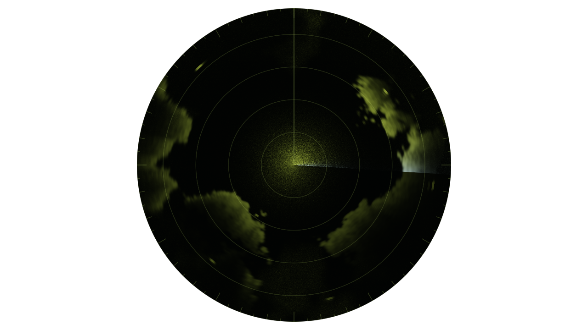
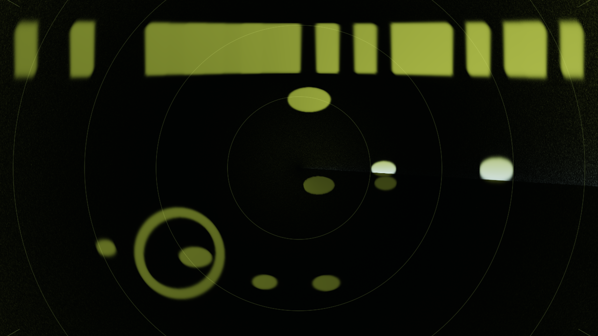

# radar

> **AI-assisted project.** This codebase was created with [Claude](https://claude.com/claude-code)
> (Anthropic), directed and reviewed by a human author. It has **never been
> loaded into Resolume**, on macOS or Windows (see [Status](#status)). Everything
> below is measured by an offline harness that drives the real plugin classes in
> a headless GL context, on this Mac's GPU at two rasters and again on Apple's
> software renderer. `ratest --arc` puts a point target on the scope and measures
> the arc it paints: its half-power width equals Beamwidth to **0.004 degrees**,
> at two ranges, with and without sidelobes. `--pulse` measures its radial streak
> at c tau / 2 to **8×10⁻⁵ of a range bin**, running outward from the target.
> `--sweep` counts every bearing bin's paints and finds each painted **exactly
> once a rotation** at whole, fractional and jittered frame rates. `--r4` fits
> the returns of equal targets to R⁻⁴ (**−3.9998**) and flat with STC at n = 4.
> `--persist` holds the phosphor to its two-term decay to **2×10⁻⁷**. `ratest
> --negative` re-runs eleven checks against deliberately wrong models, and
> `tools/mutate.sh` changes one character of the shipped shaders and sweep; every
> one is caught. A control sweep fails if any parameter does nothing.

A plan-position radar scope for Resolume Arena/Avenue, as two FFGL plugins:
**SW Radar**, a source that is a radar watching a synthetic sea, and **SW Radar
Over**, an effect that makes your clip the sea.

The source's defaults after ten seconds: a bay open to the north on a 24 km
scope, the sweep just past east with the trail fading behind it. Rendered by the
plugin's offline harness (`ratest`), not captured from Resolume.

## The one idea

**A radar scope does not show the sea. It shows the sea convolved with the
radar.** A plan-position indicator is a CRT whose trace runs out from the
centre along the antenna's bearing while the antenna turns, and every echo
brightens a long-persistence phosphor at its range and bearing. So nothing here
is drawn as a picture of a radar: a reflectivity field goes through a radar
model, and the look falls out of it.

- **The beam smears in bearing.** A point target paints an arc as wide as the
  beam, so a distant ship is a wide arc and a near one a short one.
- **The pulse smears in range**: every echo is a radial streak c tau / 2 long,
  outward from its target.
- **The sweep leaves a trail.** The phosphor (P7: a blue-white flash, then a
  yellow-green afterglow) is brightest where the antenna has just been and
  dimmest where it is about to come back.
- **The radar equation** makes near returns huge (R⁻⁴), and **STC** turns the
  gain up with range until the scope is flat. **Clutter** crowds the centre,
  **rain** drifts as speckled cells, **noise** is speckle everywhere.
- **Coasts are bright edges**: land facing the radar returns hard and the land
  behind it falls into shadow.
- **Moving contacts leave the plot of their track** in their fading paints.

In **SW Radar** the sea is synthetic: a coastline from noise (in km, so Range
zooms it), moving contacts, rain cells. In **SW Radar Over** the clip is the
reflectivity: its bright parts, laid under the scope in range and bearing,
become echoes painted by the sweep.

SW Radar Over on the harness's test card (a waterfront, boats, a ring),
covering the frame. Rendered by `ratest`.

## Controls

- **Antenna:** RPM (0 stops it; 1–120), Beamwidth (0.5–20 degrees: the width of
  the arc a point target paints), Sidelobes (0 a Gaussian beam, 1 a uniform
  aperture's, with its faint side arcs on strong targets), Direction
  (*Clockwise*/*Anticlockwise*).
- **Transmitter:** Pulse Length (0.05–20 µs; the streak is 150 m per µs), Range
  (the scope's radius, 0.5–200 km), Gain (−30 to +50 dB), STC (the gain rises as
  Rⁿ, n from 0 to 4; at 4 the radar equation is flat).
- **Returns:** Clutter (sea clutter round the centre), Noise; the source also
  has Contacts (0–16), Rain, Land and Seed; the Over has Threshold (how bright a
  part of the clip must be to echo).
- **Audio:** Audio (Resolume's FFT buffer), Audio Strobe (each onset is a burst
  of interference along the sweep, a radial spoke), and in the source Audio
  Contacts (each onset puts a strong echo just ahead of the sweep).
- **Scope:** Persistence (the afterglow's time constant, 0.1–30 s), Flash (the
  blue-white flash's strength), Phosphor (*P7*, *P19*, *Green*), Rings, Bearing
  Marks, Heading Line, Scope Size (from inscribed in the frame to covering it);
  the Over also has Mix.

## Status

**v0.1.0, 2026-09-25, and honestly early.**

It has **never been loaded into Resolume**, on macOS or Windows, and has never
been built on Windows. `oxbow probe` reads the bundles as a host does (`SW Radar`
/ `RA01` / source, `SW Radar Over` / `RA02` / effect) and `oxbow selftest`
renders 120 frames through each. No OpenFX port, no browser demo, no user
guide yet. Built and measured on macOS (Apple Silicon, M4 Max).

What is measured, on this machine, at 1280x720 and 320x180 on the GPU and at
320x180 on Apple's software renderer:

| | |
| --- | --- |
| beamwidth | a point target's arc has a half-power width of Beamwidth: 2.0025–2.0037 degrees at 2, 6.0008–6.0014 at 6, at R = 0.3 and 0.8, Sidelobes 0 and 1, each inside its derived bound; on the screen its linear width grows with R to half a pixel (11.70 and 29.65 px against 11.64 and 29.55 at 720p) |
| pulse | the streak's extent is c tau / 2 to **8×10⁻⁵ bins** at 1 and 4 µs, starting at the target's range and running outward; 17.25 px on the screen against 17.09 |
| sweep | every bin's paint count equals the crossings the clock predicts, exactly, at 25 rpm/60 fps (144 frames a rotation), 23 rpm (156.52), 59.94 fps, frames jittered 8–30 ms, anticlockwise, and 0.43 bins a frame |
| persistence | a target decays as A_f e^(−t/τ_f) + A_a e^(−t/τ_a) to **9×10⁻⁸** (flash) and **2×10⁻⁷** (afterglow) over 1.6 rotations, and the flash returns to its first level when the beam comes back 60/RPM later |
| radar equation | equal targets at R = 0.1–0.8 fall with slope −3.9998 (STC off), −2.0000 (n = 2) and 0.0000 (n = 4) |
| Over | bright squares in the clip become echoes at their bearing to 10⁻⁵ degrees and their range edges + c tau / 4 to half a clip pixel; Mix 1 is opaque; Mix 0 returns the clip, alpha and all, bit-exact |
| clock | from a host clock at 499,000,000 ms (a float resolves 32 ms there) the antenna turns to **7×10⁻¹¹ bins** of rate × elapsed over 600 frames, and every crossing is a paint |
| resize | the phosphor survives a resize mid-run bit-identical, both plugins, both ways |
| audio | the first frame after a clip trigger, loud, fires nothing; the next beat does |
| GL state | viewport, vertex array, array buffer, program, unit, framebuffer, blend, scissor, clear colour, ten texture units, both plugins |
| negative controls | **11** deliberately wrong models, **all 11** detected |
| mutants | **4** one-character changes (three GLSL, one C++), **all 4** caught |
| dead controls | **43** parameters over both plugins, all live |

Render cost (`ratest --bench`, the defaults, the median frame, on a machine
shared with other builds): **SW Radar 0.34 ms at 720p, 0.39 at 1080p, 0.74 at
4K; SW Radar Over 0.28, 0.43 and 1.17 ms** — 2–7% of a 60 fps frame. The
GPU paints only the wedge the antenna swept; the decay is timed per bearing on
the CPU.

What is **not** verified, and is the honest limit of this release:

- **Never in a host.** How 28 and 25 controls present in Resolume, the clock
  unit it sends, its FFT bins and its events are all untested.
- **The phosphor is stretched to video rates.** Real P7 flashes for microseconds;
  here the flash lasts a few frames so the sweep's leading edge shows, and the
  colours are from memory, not spectra.
- **Distributed returns are normalised.** A wider beam or a longer pulse blurs a
  coast; it does not brighten it, as it physically would. Point targets follow
  the radar equation exactly.
- **Beamwidth is the two-way width** (what a target paints); a datasheet's
  one-way beamwidth is √2 wider for the same antenna.
- **The synthetic sea is made to look right**, not measured: the land's fBm, its
  shadow, the clutter law, the rain, the contacts' speeds (in scope units, so
  Range zooms the land and leaves the traffic).
- The textbook physics (the radar equation, STC, c tau / 2) is cited from memory.

No OpenFX port yet, no browser demo.

## Build

C++17 + GLSL 4.10, CMake, FFGL 2.1 (SDK vendored as a submodule). macOS builds
are universal (arm64 + x86_64); Windows needs GLEW via vcpkg.

    git clone --recursive https://github.com/stoatworks-labs/radar
    cmake -B build -DCMAKE_BUILD_TYPE=Release
    cmake --build build
    cmake --install build          # both bundles into Resolume's Extra Effects

## Building and testing

The offline harness renders the real plugin classes headlessly:

    ./build/ratest --out /tmp/scope.png --frames 600      the source
    ./build/ratest --over --out /tmp/over.png             the effect, on a harbour card
    ./build/ratest --arc          a point target's arc is Beamwidth wide, at two ranges
    ./build/ratest --pulse        its streak is c tau / 2, outward
    ./build/ratest --sweep        every bearing painted once a rotation, at any frame rate
    ./build/ratest --persist      the two-term decay, and the repaint
    ./build/ratest --r4           R^-4 with STC off, flat at n = 4
    ./build/ratest --over-check   the clip's squares where the polar mapping puts them
    ./build/ratest --prime        no audio event on the trigger frame
    ./build/ratest --resize       the phosphor survives a resize
    ./build/ratest --clock        Resolume's 499 million ms clock, in double
    ./build/ratest --state        the GL state handed back
    ./build/ratest --sweep-law --cues --names   (no GL)
    ./build/ratest --negative     every check above, against a wrong model
    ./build/ratest --offline      the no-GL subset and its negative controls (what CI runs)
    tools/mutate.sh               one character changed, a check must fail
    python3 tools/sweep.py        no control is silently dead
    ./build/ratest --bench        720p through 4K, both plugins
    tools/verify.sh               all of it, the software renderer too, in about three minutes

Filming uses the fleet's frame format and cue sheets:

    ./build/ratest --pipe --frames 1800 --size 1280x720 --script cues.txt \
      | ffmpeg -f rawvideo -pix_fmt rgba -s 1280x720 -r 60 -i - radar.mp4
    ffmpeg -i clip.mov -f rawvideo -pix_fmt rgba -s 1280x720 - \
      | ./build/ratest --over --pipe --size 1280x720 \
      | ffmpeg -f rawvideo -pix_fmt rgba -s 1280x720 -r 60 -i - over.mp4

<!-- attributions:start -->
This project is built on other people's work — see [ATTRIBUTIONS.md](ATTRIBUTIONS.md).
<!-- attributions:end -->

## Licence

MIT.

The physics is the textbook radar: the range equation, sensitivity time
control, range resolution c tau / 2, the Gaussian and uniform-aperture antenna
patterns, and the P7 phosphor's two-component persistence. Nothing is copied
from anyone's source.
